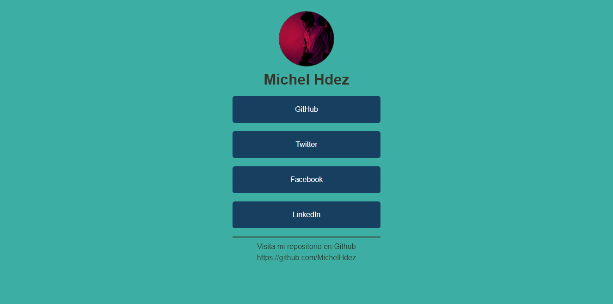

# Proyecto Link Tree
📋 Link Tree utilizando HTML y CSS

Este es un proyecto simple que puedes personalizar y compartir. 
La idea es crear tu propio listado de enlaces con una imagen tuya que demuestre quien eres.

Este tipo de páginas son populares en Instagram.

## Realizado con 🛠️
* HTML
* CSS

## Autores ✒️
* **Michel Hdez** - (https://github.com/MichelHdez)